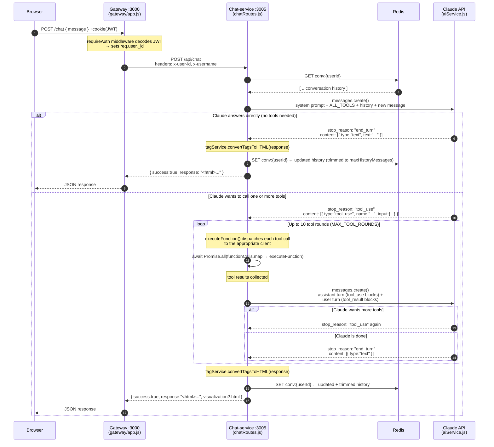
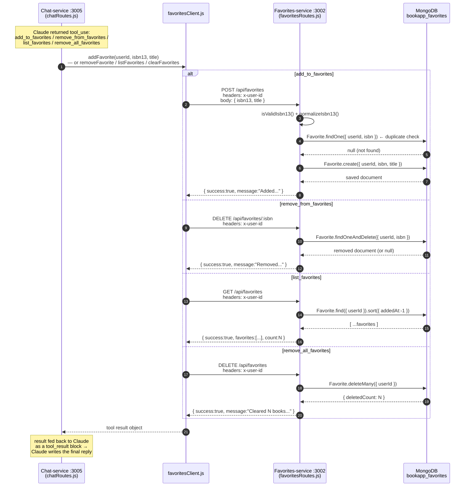
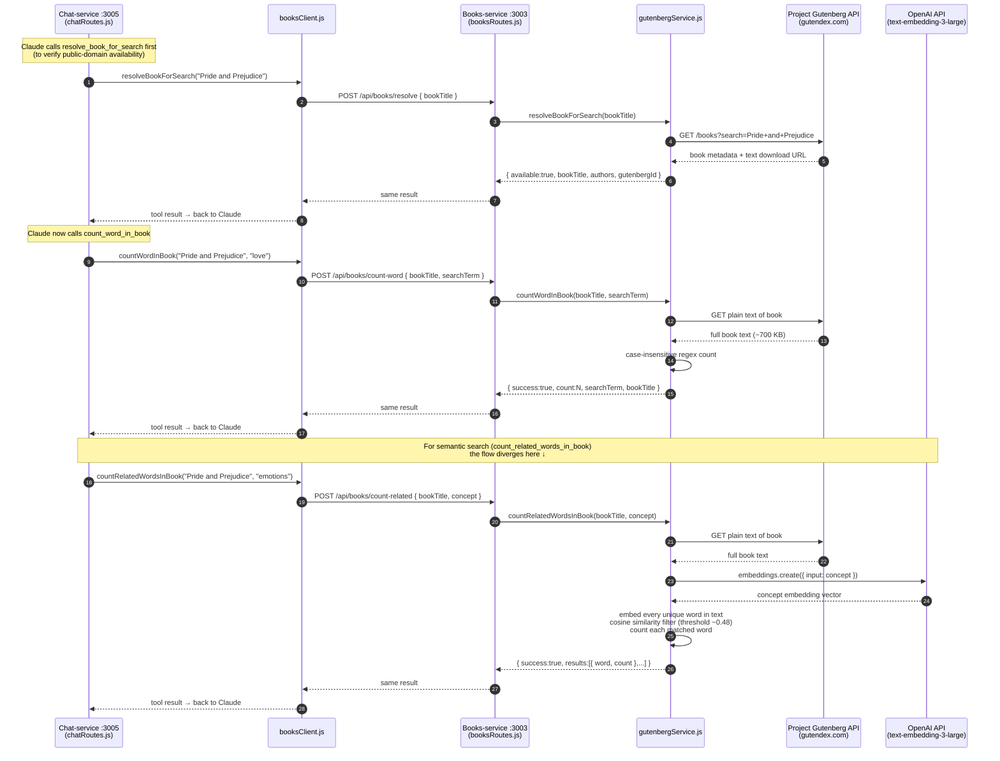
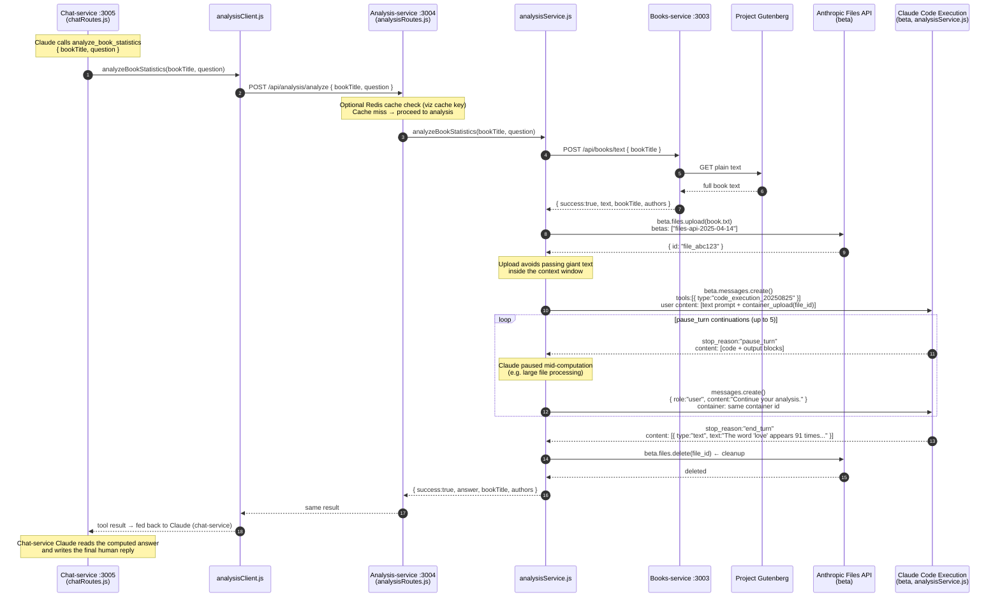
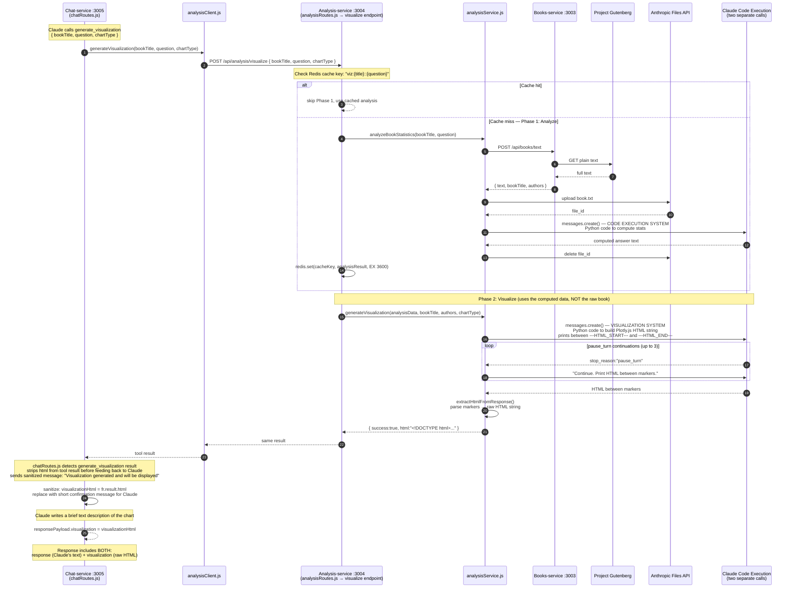
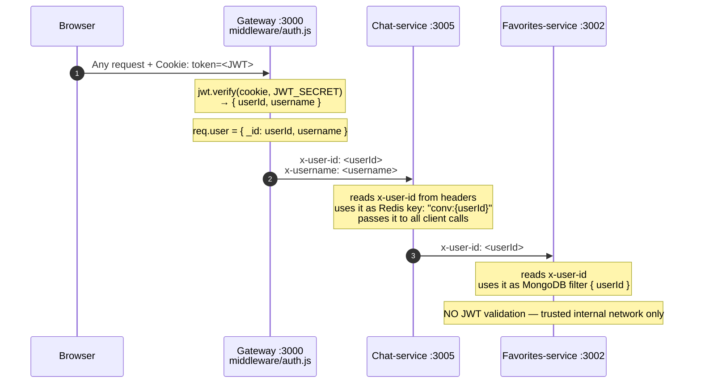

# AI Workflow — Sequence Diagrams

This document walks through how AI works in this app, from the moment a user sends a
message to the moment a response arrives back in the browser. All diagrams use the
actual service names, port numbers, and code paths in this repository.

---

## 1. Overview: How the Agentic Loop Works

The core idea: **Claude is not just answering questions — it is also deciding which tools
to call and when.** The chat-service drives a loop: ask Claude → if Claude wants a tool →
execute it → feed the result back to Claude → repeat until Claude produces plain text.

---

## 2. Favorites Tools (add / list / remove / clear)

These are the simplest tools — one round of tool use, one HTTP call, done.
Claude calls them when the user asks to manage their reading list.

---

## 3. Word Search Tools (resolve + count / semantic search)

Used when a user asks "how many times does 'love' appear in Pride and Prejudice?"
Claude first resolves the book to confirm it is on Project Gutenberg, then counts.

---

## 4. Book Statistics Analysis (analyze_book_statistics)

This is the most complex tool. Claude (inside analysis-service) uses the
**Code Execution** beta tool — it literally writes and runs Python code
against the full book text to compute exact statistics.

---

## 5. Visualization Generation (generate_visualization)

When a user asks to "chart" or "visualize" data, Claude calls `generate_visualization`.
This triggers a **two-phase** pipeline inside analysis-service: first analyze → then render.

---

## 6. How Identity Flows (x-user-id Header Chain)

No service except the gateway ever reads a JWT cookie. Identity travels as a plain
`x-user-id` header on every internal HTTP call.

---

## Summary: Which Service Uses Which AI / External API

| Service | AI / External API | Purpose |
|---|---|---|
| `chat-service` | Claude (conversational, `messages.create`) | Main chat, tool orchestration |
| `analysis-service` | Claude Code Execution beta (`code_execution_20250825`) | Run Python against full book text |
| `analysis-service` | Anthropic Files API beta | Upload book text into code execution container |
| `books-service` | OpenAI `text-embedding-3-large` | Semantic word similarity (count_related_words) |
| `books-service` | Project Gutenberg (`gutendex.com`) | Download public-domain book text |
| `chat-service` | Redis | Store conversation history per user (TTL 24h) |
| `analysis-service` | Redis | Cache visualization analysis results (TTL 1h) |
