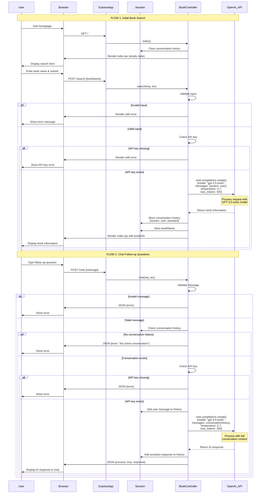

# AI ChatGPT Integration - Sequence Diagram

## Overview
This document illustrates how the ChatGPT API integration works in the BookApp application.

## Sequence Diagram (Mermaid)



## Key Components

### 1. **User & Browser**
- User interacts with the web interface
- Browser handles form submissions and AJAX requests

### 2. **Express App**
- Main application server
- Routes requests to appropriate controllers
- Manages middleware (sessions, JSON parsing, etc.)

### 3. **Session**
- Stores conversation history between requests
- Maintains context for follow-up questions
- Stores current book name

### 4. **Book Controller**
- **index()**: Initializes the app, clears session
- **search()**: Handles book search requests
- **chat()**: Handles follow-up chat messages

### 5. **OpenAI API**
- External API service (GPT-3.5-turbo model)
- Processes natural language requests
- Returns book information and chat responses

## Data Flow Details

### Initial Search Request
```javascript
// Request to OpenAI
{
  model: "gpt-3.5-turbo",
  messages: [
    {
      role: "system",
      content: "You are a helpful book expert..."
    },
    {
      role: "user",
      content: "Tell me about the book \"[bookName]\"..."
    }
  ],
  temperature: 0.7,
  max_tokens: 300
}
```

### Chat Follow-up Request
```javascript
// Request to OpenAI (includes full history)
{
  model: "gpt-3.5-turbo",
  messages: [
    { role: "system", content: "..." },
    { role: "user", content: "Tell me about..." },
    { role: "assistant", content: "..." },
    { role: "user", content: "Follow-up question" }
    // ... more messages
  ],
  temperature: 0.7,
  max_tokens: 300
}
```

## Session Storage Structure

```javascript
req.session = {
  conversationHistory: [
    { role: "system", content: "..." },
    { role: "user", content: "..." },
    { role: "assistant", content: "..." },
    // ... more messages as conversation continues
  ],
  bookName: "Name of searched book"
}
```

## Error Handling

The application handles several error scenarios:
1. Empty or missing input
2. Missing OpenAI API key
3. No active conversation (for chat)
4. OpenAI API errors
5. Network/server errors

## Technology Stack

- **Backend**: Node.js + Express
- **Session Management**: express-session
- **AI Integration**: OpenAI SDK (openai npm package)
- **View Engine**: EJS
- **Model**: GPT-3.5-turbo

## Configuration

Required environment variables:
- `OPENAI_API_KEY`: Your OpenAI API key
- `SESSION_SECRET`: Secret for session encryption

