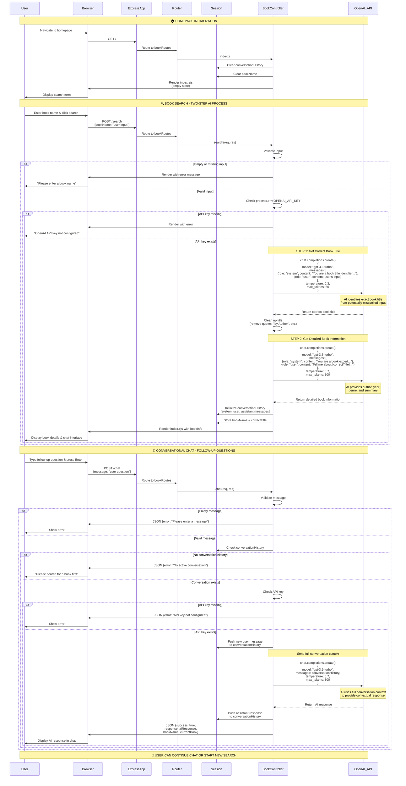

# AI ChatGPT Integration - Complete Workflow Diagram

## Overview
This document provides a comprehensive visualization of how the AI workflow operates in the BookApp application, including the two-step book search process and conversational chat feature.

## Complete AI Workflow Sequence Diagram



## Key Components Explained

### 1. **User & Browser**
- **User**: Interacts with the web interface (searches for books, asks questions)
- **Browser**: Renders the UI, handles form submissions (POST /search) and AJAX requests (POST /chat)

### 2. **Express App & Router**
- **Express App**: Main Node.js server running on port 3000
- **Router**: Routes incoming HTTP requests to appropriate controller methods
  - `GET /` → `bookController.index()`
  - `POST /search` → `bookController.search()`
  - `POST /chat` → `bookController.chat()`

### 3. **Session Storage**
- **Purpose**: Maintains conversation state across multiple HTTP requests
- **Data Stored**:
  - `conversationHistory`: Array of all messages (system, user, assistant)
  - `bookName`: The correctly formatted book title
- **Lifetime**: 24 hours (configured in app.js)

### 4. **Book Controller** (The Brain)
- **index()**: Initializes homepage, clears all session data
- **search()**: Two-step AI process
  1. Calls OpenAI to get correct book title
  2. Calls OpenAI again to get detailed information
  3. Stores conversation in session
- **chat()**: Handles follow-up questions using conversation history

### 5. **OpenAI API** (External AI Service)
- **Model**: GPT-3.5-turbo
- **Purpose**: 
  - Corrects book titles from user input
  - Provides book information (author, year, genre, summary)
  - Answers follow-up questions with conversational context
- **Authentication**: Requires `OPENAI_API_KEY` environment variable

## Detailed Data Flow & AI Requests

### Step 1: Title Correction Request
**Purpose**: Convert user's potentially misspelled input into correct book title

```javascript
// First OpenAI API Call (in search function)
{
  model: "gpt-3.5-turbo",
  messages: [
    {
      role: "system",
      content: "You are a book title identifier. Return ONLY the book title, nothing else. No quotes, no author name, no explanations..."
    },
    {
      role: "user",
      content: "harry poter"  // User's misspelled input
    }
  ],
  temperature: 0.3,  // Low temperature for accurate identification
  max_tokens: 50
}

// AI Response: "Harry Potter and the Philosopher's Stone"
```

**Post-processing**: Remove quotes, "by Author" text, clean formatting

### Step 2: Book Information Request
**Purpose**: Get detailed information about the correctly identified book

```javascript
// Second OpenAI API Call (in search function)
{
  model: "gpt-3.5-turbo",
  messages: [
    {
      role: "system",
      content: "You are a helpful book expert. Provide detailed information about books including author, publication year, genre, and a brief summary. Keep responses concise but informative (around 150-200 words). IMPORTANT: When referring to the book title, always use this exact format: \"Harry Potter and the Philosopher's Stone\""
    },
    {
      role: "user",
      content: "Tell me about the book \"Harry Potter and the Philosopher's Stone\". Include the author, publication year, genre, and a brief summary."
    }
  ],
  temperature: 0.7,  // Higher temperature for creative descriptions
  max_tokens: 300
}

// AI Response: Detailed book information...
```

### Step 3: Conversational Follow-up Request
**Purpose**: Answer user's questions using full conversation context

```javascript
// OpenAI API Call (in chat function)
{
  model: "gpt-3.5-turbo",
  messages: [
    { role: "system", content: "You are a helpful book expert. The user has just searched for information about a book..." },
    { role: "user", content: "Tell me about the book \"Harry Potter and the Philosopher's Stone\"..." },
    { role: "assistant", content: "Harry Potter and the Philosopher's Stone is a fantasy novel..." },
    { role: "user", content: "Who are the main characters?" },  // User's follow-up
    { role: "assistant", content: "The main characters include Harry Potter, Hermione Granger..." },
    { role: "user", content: "What about the plot twists?" }  // Current question
    // ... conversation continues
  ],
  temperature: 0.7,
  max_tokens: 300
}
```

## Session Storage Structure

The session stores the complete conversation context, enabling the AI to provide contextual responses.

### After Initial Search (3 messages stored):
```javascript
req.session = {
  conversationHistory: [
    { 
      role: "system", 
      content: "You are a helpful book expert. The user has just searched for information about a book. Provide detailed, conversational answers to their follow-up questions about this book or related topics. Keep responses concise but informative. IMPORTANT: When referring to the book title, always use this exact format: \"Harry Potter and the Philosopher's Stone\""
    },
    { 
      role: "user", 
      content: "Tell me about the book \"Harry Potter and the Philosopher's Stone\". Include the author, publication year, genre, and a brief summary."
    },
    { 
      role: "assistant", 
      content: "Harry Potter and the Philosopher's Stone is a fantasy novel by J.K. Rowling, published in 1997. It follows eleven-year-old Harry Potter, who discovers he's a wizard and attends Hogwarts School of Witchcraft and Wizardry. The story combines themes of friendship, courage, and good versus evil as Harry uncovers the truth about his parents' death and confronts the dark wizard Voldemort. The book launched one of the most successful literary franchises in history, appealing to both children and adults with its magical world-building and relatable characters."
    }
  ],
  bookName: "Harry Potter and the Philosopher's Stone"
}
```

### After User Asks "Who are the main characters?":
```javascript
req.session = {
  conversationHistory: [
    { role: "system", content: "..." },
    { role: "user", content: "Tell me about the book..." },
    { role: "assistant", content: "Harry Potter and the Philosopher's Stone is a fantasy novel..." },
    { role: "user", content: "Who are the main characters?" },  // Added by chat()
    { role: "assistant", content: "The main characters include Harry Potter, an orphaned boy who discovers he's a wizard; Hermione Granger, a brilliant and studious witch; Ron Weasley, Harry's loyal best friend from a large wizarding family; Albus Dumbledore, the wise headmaster of Hogwarts; and Severus Snape, a mysterious potions professor. The antagonist is Lord Voldemort, the dark wizard who killed Harry's parents." }  // Added by chat()
  ],
  bookName: "Harry Potter and the Philosopher's Stone"
}
```

**Key Points:**
- Conversation history grows with each chat interaction
- Full history is sent to OpenAI on every request (provides context)
- Session persists for 24 hours
- Searching for a new book clears the session and starts fresh

## How the AI Workflow Works (Plain English)

### 1️⃣ User Visits Homepage
- Server renders empty search page
- Session is cleared (no previous conversations)

### 2️⃣ User Searches for a Book (e.g., "harry poter")
**The Magic Happens Here:**

1. **Input Validation**: System checks if user entered something
2. **API Key Check**: Verifies OpenAI API key exists
3. **AI Call #1 - Title Correction** (Smart Feature!)
   - System asks AI: "What's the correct title for 'harry poter'?"
   - AI responds: "Harry Potter and the Philosopher's Stone"
   - System cleans up the response (removes quotes, author names)
4. **AI Call #2 - Get Book Details**
   - System asks AI: "Tell me about 'Harry Potter and the Philosopher's Stone'"
   - AI provides: author, year, genre, summary (150-200 words)
5. **Session Storage**
   - System stores the entire conversation (system prompt, user question, AI response)
   - Stores the correct book title
6. **Display Results**
   - Page shows book information
   - Chat interface appears for follow-up questions

### 3️⃣ User Asks Follow-up Questions (e.g., "Who are the main characters?")
**Conversational AI:**

1. **Validation**: Checks if message is not empty
2. **Session Check**: Verifies user has searched for a book first
3. **Add to History**: Adds user's new question to conversation history
4. **AI Call - With Full Context**
   - System sends ENTIRE conversation history to AI
   - AI understands context and provides relevant answer
5. **Update History**: Adds AI's response to conversation
6. **Return Response**: Displays AI's answer in chat interface

### 4️⃣ Conversation Continues
- User can ask unlimited follow-up questions
- Each response considers all previous messages
- Conversation persists for 24 hours
- Searching for a new book starts a fresh conversation

## Error Handling

The application robustly handles multiple error scenarios:

1. **Empty or missing input**: "Please enter a book name"
2. **Missing OpenAI API key**: "OpenAI API key is not configured"
3. **No active conversation**: "No active conversation. Please search for a book first."
4. **OpenAI API errors**: "An error occurred while fetching book information"
5. **Network/server errors**: Graceful error messages with try-catch blocks

## Technology Stack

### Backend
- **Runtime**: Node.js
- **Framework**: Express.js
- **View Engine**: EJS (with ejs-mate)
- **Session Management**: express-session (24-hour cookie lifetime)

### AI Integration
- **SDK**: OpenAI npm package
- **Model**: GPT-3.5-turbo
- **Temperature Settings**:
  - Title correction: 0.3 (precise, deterministic)
  - Book info & chat: 0.7 (creative, conversational)
- **Token Limits**:
  - Title correction: 50 tokens
  - Book info & chat: 300 tokens

### Frontend
- **HTML Templates**: EJS
- **Styling**: CSS
- **AJAX**: Fetch API for chat functionality

## Configuration

### Required Environment Variables (.env file)
```bash
OPENAI_API_KEY=sk-your-api-key-here
SESSION_SECRET=your-secret-key-change-in-production
```

### Port Configuration
- Default: Port 3000
- Configured in `app.js`

## Key Design Decisions

### Why Two AI Calls for Search?
1. **Title Correction** (First Call)
   - Users often misspell book titles
   - Ensures consistent formatting
   - Low temperature (0.3) for accuracy
2. **Book Details** (Second Call)
   - Uses corrected title for accurate results
   - Higher temperature (0.7) for engaging descriptions

### Why Store Conversation History?
- Enables contextual, multi-turn conversations
- AI understands references to previous questions
- Creates natural, human-like interactions

### Why Session-based Storage?
- Maintains state across HTTP requests
- No database needed for temporary conversations
- Automatic cleanup after 24 hours

## API Cost Optimization

Each interaction consumes tokens:
- **Initial Search**: ~400-500 tokens (2 API calls)
- **Each Chat Message**: ~200-400 tokens (1 API call)
- **Session Limit**: 24 hours prevents indefinite history growth

## Files Involved

| File | Purpose | Key Functions |
|------|---------|---------------|
| `app.js` | Express app setup, middleware, session config | Session initialization, middleware setup |
| `routes/books.js` | Route definitions | GET /, POST /search, POST /chat |
| `controllers/bookController.js` | Business logic, OpenAI API calls | `index()`, `search()`, `chat()` |
| `views/books/index.ejs` | UI template for search and chat | Display book info, chat interface |
| `.env` | Environment variables (API keys) | OPENAI_API_KEY, SESSION_SECRET |

## Quick Reference: Request Flow

### Homepage Visit
```
Browser → GET / → Router → bookController.index() → Render empty page
```

### Book Search
```
Browser → POST /search → Router → bookController.search() → 
  1. Validate input ✓
  2. OpenAI API Call #1 (title) ✓
  3. Clean title ✓
  4. OpenAI API Call #2 (info) ✓
  5. Store in session ✓
  6. Render results ✓
```

### Chat Message
```
Browser → POST /chat → Router → bookController.chat() →
  1. Validate message ✓
  2. Check session ✓
  3. Add to history ✓
  4. OpenAI API Call ✓
  5. Update history ✓
  6. Return JSON response ✓
```

## Troubleshooting Common Issues

| Issue | Possible Cause | Solution |
|-------|---------------|----------|
| "OpenAI API key not configured" | Missing .env file or OPENAI_API_KEY | Create .env file with valid API key |
| "No active conversation" | User clicked chat without searching first | Search for a book before chatting |
| API timeout | Long response or network issue | Increase timeout or retry |
| Empty book info | Invalid book name or API error | Check API key, try different book |
| Session lost | 24-hour expiration or server restart | Search for book again |

## Example Usage Scenario

1. **User visits** `http://localhost:3000`
2. **User types**: "harry poter sorcerer stone"
3. **System corrects to**: "Harry Potter and the Philosopher's Stone"
4. **System displays**: Author, year, genre, summary
5. **User asks**: "Who are the main characters?"
6. **AI responds**: With character details (remembers the book context)
7. **User asks**: "What about Hogwarts houses?"
8. **AI responds**: With house information (remembers all previous context)
9. **Conversation continues** until user searches for a new book or session expires

